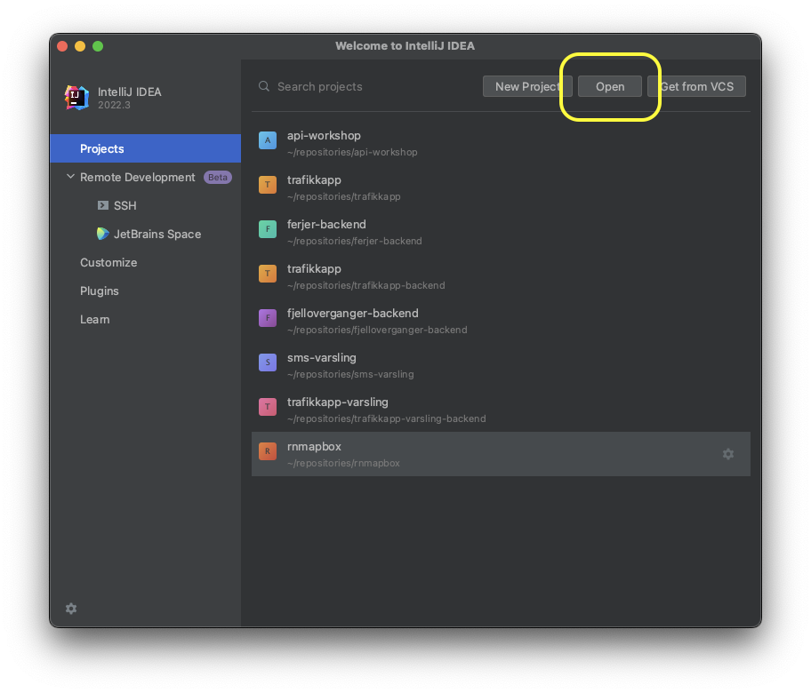
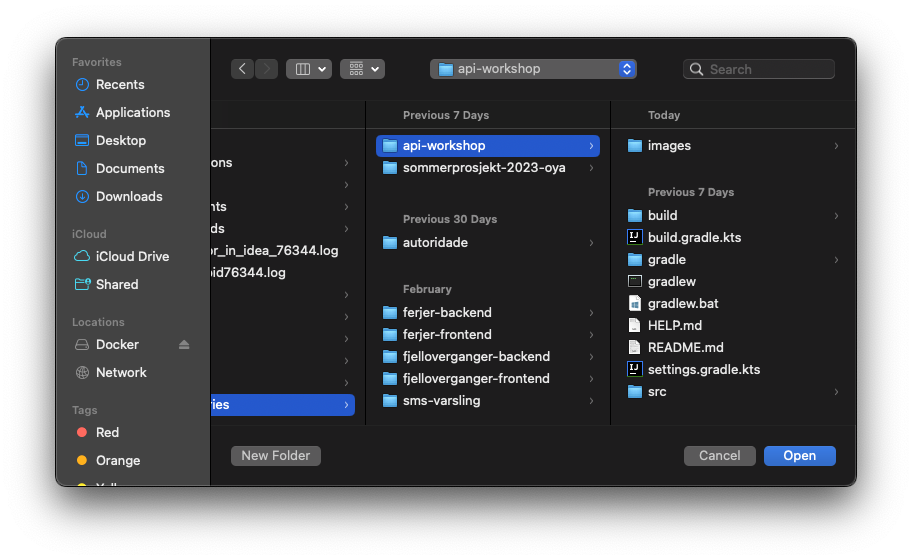
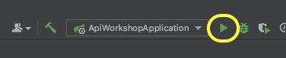
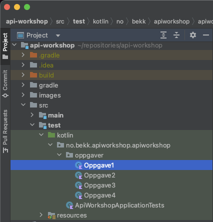
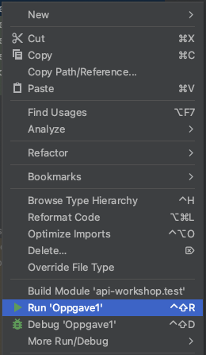

# API-workshop

Backendtjenester kommer i mange former og fasonger, fra kjernebanksystemer som holder styr på kontoen din til webservere som håndterer forespørsler og returnerer informasjon.
Vi skal i denne workshopen se næmere på sistnevnte og sammen designe noen enkle API.

## Kom i gang

Vi skal bruke [Intellij](https://www.jetbrains.com/idea/) som IDE, [Gradle](https://gradle.org/) som byggverktøy og Java 17.

### Intellij
Intellij er en IDE (Integrated Development Environment) som er laget av JetBrains. Den er veldig populær blant Java-utviklere og har mange funksjoner som gjør det enklere å utvikle kode.

Hvis dere ikke allerede har installert Intellij kan dere [laste det ned her](https://www.jetbrains.com/idea/download/).
Velg community edition, som er gratis, hvis dere ikke har en lisens for ultimate edition.

### Gradle

Gradle er et byggverktøy som brukes til å bygge og kjøre prosjekter. 
Det er et alternativ til Maven, som er et annet populært byggverktøy.
Gradle blir installert av Intellij som en del av prosjektet, så det er ikke nødvendig å installere det separat.

### Java 17

Kotlin kjører på JVM (Java Virtual Machine), så vi trenger Java for å kjøre Kotlin-koden vår.

### Kjøre prosjektet

1. Klon repoet. I terminalen kjør denne kommandoen:
```
git clone git@github.com:gammalost/api-workshop.git
```
2. Åpne intellij og så åpne repoet du klonet

 

3. Start applikasjonen og gå til `http://localhost:8080/hello` og sjekk at du får `Hello world!` tilbake  
   * Nb: det kan ta litt tid for gradle å laste ned pakker som trengs for å kjøre applikasjonen. 
   * Hvis `ApiWorkshopApplication ` ikke vises kan du åpne filen `ApiWorkshopApplication.kt` 
      og klikke på play-knappen til venstre for `fun main`.
   * Hvis dere ikke allerede har Java installert er det mulig å gjøre det via Intellij.
     Velg `File` -> `Project Structure` -> `Project` -> `SDK` -> `Add SDK` -> `Download JDK` og velg versjon 17.
     Hvis dette ikke fungerer, sjekk om det er en annen versjon av Java som er installert i terminalen (`java --version`) og endre denne til Java 17.



4. Sjekk at du får kjørt testene til oppgave 1 (høyreklikk på filen og så kjør den)

 


Et voilà! Om alt har gått knirkefritt så skal du nå være klar til å ta fatt på oppgavene! 🚀 Hvis ikke så rop ut, så kommer vi og hjelper! 🏃💨


## Okey... hva nå?

Det er satt opp tre filer, 
[UserController](src/main/kotlin/no/bekk/apiworkshop/apiworkshop/controller/UserController.kt), 
[UserService](src/main/kotlin/no/bekk/apiworkshop/apiworkshop/service/UserService.kt) og 
[UserRepository](src/main/kotlin/no/bekk/apiworkshop/apiworkshop/repository/UserRepository.kt). 
`UserController` og `UserService` er foreløpig tomme klasser - det er disse du skal legge til funksjonalitet i gjennom oppgavene. 
For å gjøre det litt lettere er `UserRepository` satt opp på forhånd med de funksjonene du skal trenge for å hente data fra databasen.


<figure>
   
   <figcaption>Enkel skisse over arkitekturen til backenden du skal jobbe med</figcaption>
</figure>


For en liten recap av presentasjonen så er:
* Controller der vi definerer API-et (eksempel i [UserController](src/main/kotlin/no/bekk/apiworkshop/apiworkshop/controller/UserController.kt) med `helloWorld`-funksjonen)
* Service der vi legger logikk (eksempel i [UserService](src/main/kotlin/no/bekk/apiworkshop/apiworkshop/service/UserService.kt) med `helloWorld`-funksjonen))
* Repository der vi jobber mot persistent lagring (les: databaser) 

Databasen som er satt opp er en enkel in memory [H2](https://www.h2database.com/html/main.html)-database.
For testene er denne denne fyllt med litt innhold. Akkurat hva kan du se i [data.sql](src/main/resources/data.sql).

## Oppgaver
Under er en liste over oppgavene med tilhørende tema 

* [Oppgave 1 - HTTP-kall](oppgaver/oppgave1.md)
* [Oppgave 2 - HTTP-statuer](oppgaver/oppgave2.md)
* [Oppgave 3 - Forretningslogikk](oppgaver/oppgave3.md)
* [Oppgave 4 - Videre](oppgaver/oppgave4.md)

